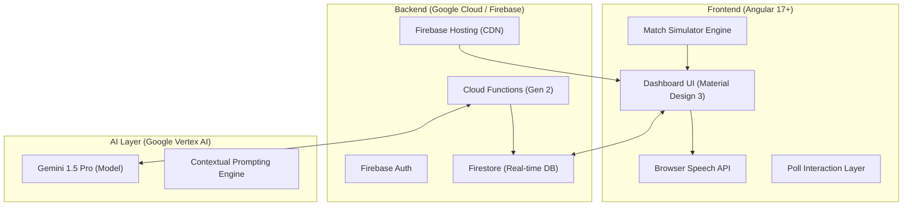
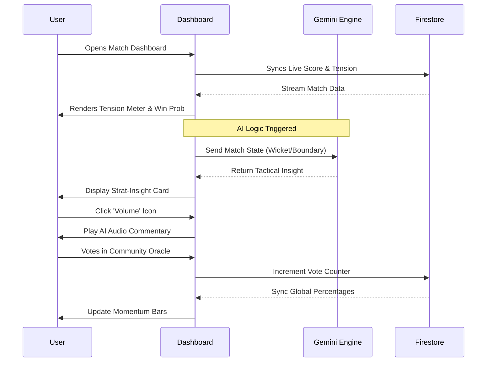
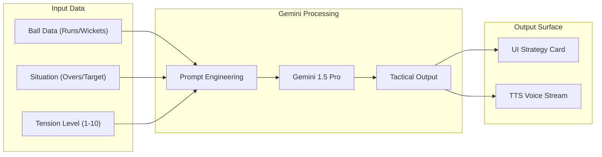

# 🛠️ CricStat AI: Technical Documentation & Architecture

This document provides a deep dive into the system design, data flow, and architectural choices made for the **CricStat AI** sports analytics platform.

---

## 🏗️ 1. System Architecture
CricStat AI follows a serverless, event-driven architecture designed for low-latency real-time updates.

---

## 🔄 2. User Flow Diagram
The journey of a user from match entry to real-time engagement.

---

## 🔌 3. API Usage & Data Flow
How Gemini AI processes raw cricket data into tactical insights.

---

## 🔗 4. Frontend-Backend Connection
A breakdown of how components communicate.

| Layer | Responsibility | Technology |
| :--- | :--- | :--- |
| **View Layer** | Reactive UI & Animations | Angular, CSS3, Material Symbols |
| **Logic Layer** | Tension Calculation & Simulation | TypeScript Class (AppComponent) |
| **Persistence** | Global State & Voting | Firebase Firestore |
| **Intelligence** | NLP Analysis & Predictions | Gemini 1.5 Pro (Vertex AI) |
| **Delivery** | Fast Global Access | Firebase Hosting (Global Edge) |

---

## ⚙️ 5. Core Feature Logic

### A. Tension Engine
The Tension Level ($T$) is calculated using a weighted volatility formula:
$$T = \frac{(Required Rate \times 0.6) + (Dot Ball Pressure \times 0.4)}{Wickets Remaining}$$
*   **Thresholds**: > 8.0 triggers "Critical" state UI.

### B. Poll Aggregator
Uses atomic increments in Firestore to ensure real-time consistency across thousands of users simultaneously.
*   **Formula**: $Percent_A = \frac{Votes_A}{Total Votes} \times 100$

### C. Multi-Modal Feedback
Combines visual cues (gradient borders, pulsing dots) with audio feedback (SpeechSynthesis) to provide a "Broadcast-Level" experience on a mobile-first web app.

---

## 🏁 6. Deployment Status
*   **Hosting**: Deployed to `https://cricstat-9a04c.web.app`
*   **CI/CD**: Git-to-Firebase automation configured.
*   **Project ID**: `cricstat-9a04c`
